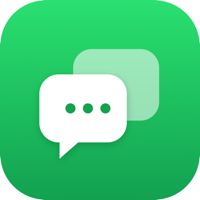

<div align="center">
  
  <h1>MultiZap</h1>
  <p><strong>Run multiple WhatsApp accounts in one native macOS app — without Electron.</strong></p>

  <p><a href="https://victorandraad.github.io/MultiZap/"><strong>🌐 Website</strong></a> · <a href="https://github.com/victorandraad/MultiZap/releases/latest"><strong>⬇ Download</strong></a></p>

  <p>
    
    
    
    
  </p>
</div>

---

MultiZap keeps several WhatsApp Web sessions side by side in a single, lightweight macOS window. Each account runs in its **own isolated session**, so your numbers never mix. It's built with **SwiftUI + WKWebView** — the same engine Safari uses — so there's **no bundled Chromium**: the app itself is a few MB instead of the ~200 MB an Electron app ships.

> **The niche it fills:** every multi-account WhatsApp client out there is Electron (heavy). Every *native* one only does a single account. MultiZap is the one that's **native, light, and multi-account.**

## ✨ Features

- **Multiple accounts, isolated** — each account gets its own persistent `WKWebsiteDataStore`. Log in once, stay logged in.
- **Real profile identity** — the sidebar shows each account's **real profile photo and number**, pulled automatically (you can rename or switch to a color).
- **Native notifications with content** — sender + message preview, delivered by macOS. Click one to jump straight to that account.
- **Unread badges** — per-account and a combined total on the Dock icon.
- **Memory modes (per account)** — choose how much RAM each account is allowed to use:
  | Mode | RAM | Notifications |
  |------|-----|---------------|
  | ⚡ **Always on** | ~350 MB | instant, with content |
  | 🍃 **Economy** (default) | ~0 while asleep | generic, checked every N min |
  | ✋ **Manual** | 0 | none in background |
- **Keyboard shortcuts** — `⌘1…⌘9` switch accounts, `⇧⌘]` / `⇧⌘[` cycle, `⌘R` reload.
- **Calls work** — camera/mic permissions are granted for voice & video calls.

## 💡 Why native beats Electron here

|                         | MultiZap (native) | Electron clients |
|-------------------------|:-----------------:|:----------------:|
| App size on disk        | **~5 MB**         | ~200 MB          |
| Browser engine          | system WebKit (0 extra) | bundled Chromium |
| Base memory overhead    | **~86 MB**        | ~200–250 MB      |
| Runs native on Apple Silicon | ✅ arm64     | usually          |

WhatsApp Web itself costs the same everywhere — MultiZap just saves you the Chromium tax.

## 📦 Install

Download the latest `MultiZap.dmg` from the [**Releases**](../../releases) page, open it, and drag **MultiZap** to Applications.

> The app is signed with a **self-signed** certificate, so on first launch macOS may warn it's from an unidentified developer. Right-click the app → **Open** → **Open** to allow it (only needed once).

## 🔒 Privacy

MultiZap is a **local wrapper** around the official WhatsApp Web. It has **no server, no analytics, and sends nothing anywhere**. Your sessions live only on your Mac (in the app's data store). Profile photos are cached locally in `~/Library/Application Support/MultiZap/`.

## 🛠 Build from source

Requires **Xcode 16+** (Swift 6) on macOS 14+.

```bash
git clone https://github.com/victorandraad/MultiZap.git
cd MultiZap
./setup-signing.sh   # one-time: creates a stable local signing identity
./build-app.sh       # compiles + packages MultiZap.app
open MultiZap.app
```

## 🧩 How it works

- Each account is a `WKWebView` pointed at `web.whatsapp.com` with an isolated data store keyed by UUID.
- Notifications are captured by polyfilling the page's `Notification` / `ServiceWorkerRegistration.showNotification` APIs (WKWebView doesn't implement Web Notifications), then re-posted as native `UNUserNotification`s.
- In **Economy** mode, inactive accounts are torn down to free RAM and briefly re-loaded on a timer to check for new messages — the session persists on disk, so no re-scan is needed.

## ⚠️ Note

MultiZap wraps the **official WhatsApp Web**; it does not reimplement WhatsApp's protocol, so there's no elevated ban risk beyond using WhatsApp Web normally. Identity/photo scraping reads WhatsApp Web's DOM — if WhatsApp significantly changes its layout, the app falls back to a colored initial (it never breaks).

## 📄 License

MIT — see [LICENSE](LICENSE).

<div align="center"><sub>Not affiliated with WhatsApp or Meta. WhatsApp is a trademark of Meta Platforms, Inc.</sub></div>
